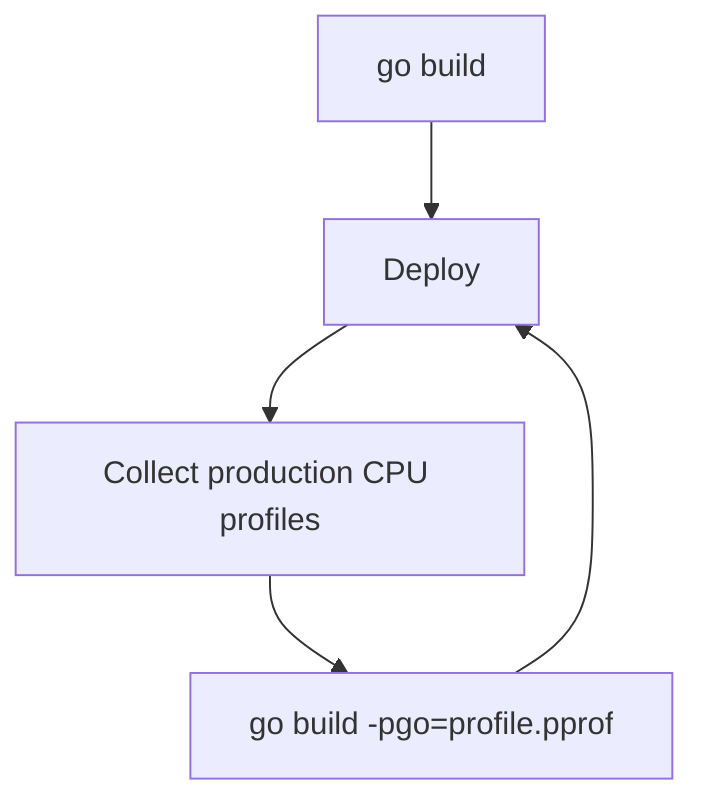

# Benchmarking

---

## What is benchmarking?

> A technique for measuring the performance of code to identify bottlenecks and improve efficiency.

---

## Benchmark tests

Two developers are arguing whether it's faster to use a map or a slice to search through a list of movies.

We expect the map to be faster once there's a non-trivial number of items in the list.


But how can we prove it?

---

## Benchmark Test - benchmark_test.go
```go{all|1|3-11|8-10|12-20|21-22|23-24}{lines:true}
import "testing"

func benchmarkFilmMap(title string, b *testing.B) {
	m, err := NewFilmMap()
	if err != nil {
		b.Error(err)
	}
	for range b.N {
		SearchFilmMap(m, title)
	}
}
func benchmarkFilmSlice(title string, b *testing.B) {
	s, err := NewFilmSlice()
	if err != nil {
		b.Error(err)
	}
	for range b.N {
		SearchFilmSlice(s, title)
	}
}
func BenchmarkMapExistingFilm(b *testing.B)   { benchmarkFilmMap("Star Wars: Episode I – The Phantom Menace", b) }
func BenchmarkMapMissingFilm(b *testing.B)    { benchmarkFilmMap("Spider-Man 3", b) }
func BenchmarkSliceExistingFilm(b *testing.B) { benchmarkFilmSlice("Star Wars: Episode I – The Phantom Menace", b) }
func BenchmarkSliceMissingFilm(b *testing.B)  { benchmarkFilmSlice("Spider-Man 3", b) }
```

---

# Running benchmark tests

```sh
go test -bench=.
```

---

# Output

```
goos: linux
goarch: amd64
pkg: github.com/a-h/go-workshop/200/benchmarking
cpu: 11th Gen Intel(R) Core(TM) i7-11850H @ 2.50GHz
BenchmarkMapExistingFilm-16               863116              1392 ns/op
BenchmarkMapMissingFilm-16              157165226                7.919 ns/op
BenchmarkSliceExistingFilm-16             369318              3259 ns/op
BenchmarkSliceMissingFilm-16              579453              2021 ns/op
PASS
ok      github.com/a-h/go-workshop/200/benchmarking     7.782s
```

---

# Profiling


---
layout: two-cols-header
---

# Profile guided compiler optimisation

::left::

Profile Guided Optimisation (PGO) takes real world performance data and use it to inform optimisations during the compilation process.

You might see up to 15% performance improvements with PGO.

::right::


