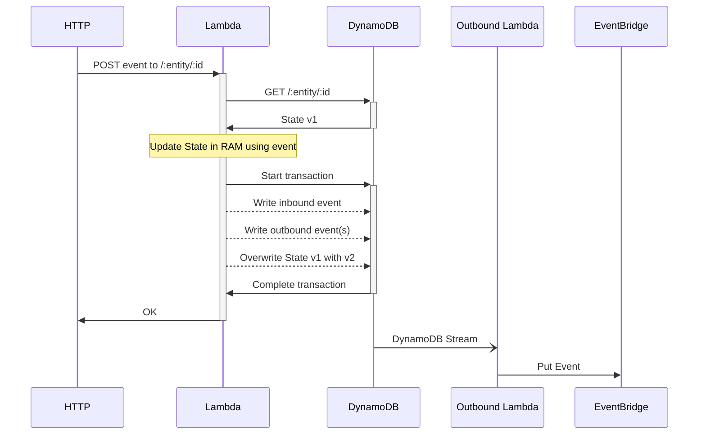

# Go experience

---
layout: two-cols-header
---

# Background

::left::

- Started programming in 1980's in BASIC on a VIC-20
- First professional job in 2001, writing VB and ASP 3.0
- Moved to VB.Net and ASP.NET in 2002
- Migrated to C# since 2004
- Built a product in C# and maintained it for 10 years
- Tech lead on 2 projects that took > £1B revenue 

::right::


---
layout: two-cols-header
---

# Why Go?

::left::

- Simple, fast, and productive
- Tried out lots of languages...
- Tooling, not language
- .NET started up slowly, and was too memory heavy for Lambda
- Don't like having to have the right runtimes and packages installed

::right::


---
layout: two-cols-header
---

# First major Go project - Well Pharmacy

::left::


::right::

- Medicine search was slow
- I said it would be faster in Go than JavaScript
- Rewrote it in Go on the train home
- It was 100x faster
- The team adopted it organically

---

# Talk

<Youtube id="hTfxc4qcCC0" width="600" height="300"/>

---
layout: two-cols-header
---

# Aviva Zero

::left::

- New digital insurance platform
- Chose Go, Next.js, and Serverless
- From inception to first sale in 7 months
- Launched in 2022

::right::


---
layout: section
---

# Why Go for Aviva Zero?

---

# Major project in the middle

- After experience at Well, did a major project with full-stack TypeScript
- Reflected on experience:
   - JavaScript specific bugs
   - Build and test performance
   - Clashing styles from different team members

---

# Transactional layer architecture


---
layout: section
---

# Synchronous APIs

---


---

# Lambda HTTP adapters

```go {|7}
func handler(w http.ResponseWriter, r *http.Request) {
  json.NewEncoder(w).Encode("hello, world")
}

func main() {
  http.HandleFunc("/hello", handler)
  algnhsa.ListenAndServe(http.DefaultServeMux, nil)
}
```

---

# This pattern at ITV

<Youtube id="bUtgi02iD6s" width="600" height="300"/>

---
src: single-table-design.md
---

---

# Outbox pattern


---
src: event-sourced-design.md
---

---

<div style="width: 80%; position: absolute; left: 10%; top: 1%;">



</div>

---

# Stream library - github.com/a-h/stream

```go
type SlotMachine struct {
	ID      string `json:"id"`
	// How much is paid out if you win.
	Payout int `json:"payout"`
	// How likely you are to get paid out.
	WinChance    float64 `json:"winChance"`
	IsCoinInSlot bool    `json:"isCoinInSlot"`
}
```

---

# Update state on inbound event or command

```go
func (s *SlotMachine) InsertCoin() (outbound []stream.OutboundEvent, err error) {
	if s.IsCoinInSlot {
		return nil, ErrCannotInsertCoin
	}
	s.IsCoinInSlot = true
	return
}
```

---

# Update state and return outbound events

```go
func (s *SlotMachine) PullHandle(e PullHandle) (outbound []stream.OutboundEvent, err error) {
	// Take the money.
	if !s.IsCoinInSlot {
		return nil, ErrCannotPullHandle
	}
	s.IsCoinInSlot = false

	// Did they win?
	won := rand.Float64() < s.WinChance

	// Send events.
	outbound = append(outbound, GamePlayed{
		MachineID: s.ID,
		Won:       won,
	})
	if won {
		outbound = append(outbound, PayoutMade{
			UserID: e.UserID,
			Amount: s.Payout,
		})
	}
	return
}
```

---
layout: section
---

# Event-driven functions

---

# Asynchronous processing


---

# Dead letter queue

```go {|3|4|7|17}
awslambdago.NewGoFunction(stack, jsii.Ptr("bacsOutboundFile"), &awslambdago.GoFunctionProps{
	Runtime:          awslambda.Runtime_PROVIDED_AL2(),
	Architecture:     awslambda.Architecture_ARM_64(),
	MemorySize:       jsii.Number(1024),
	Bundling:         bundlingOptions,
	AllowAllOutbound: jsii.Bool(false),
	Entry:            jsii.Ptr("../events/bacsoutbound/lambda"),
	Vpc:              vpc,
	Role:             bacsOutboundFileRole,
	Timeout:          awscdk.Duration_Minutes(jsii.Number(15)),
	VpcSubnets: &awsec2.SubnetSelection{
		Subnets: vpc.PrivateSubnets(),
	},
	RetryAttempts:  jsii.Number(2),
	SecurityGroups: lambdaSecurityGroups,
	Tracing:        awslambda.Tracing_ACTIVE,
	OnFailure:      awslambdadestinations.NewSqsDestination(bacsOutboundFileLambdaDLQ),
})
```

---

# Asynchronous processing


---

# Document generation with templ

```templ
templ Document(d *Document) {
  <div>
    Hello { d.FirstName }, and welcome.
  </div>

  <div>
    Your policy starts on { d.StartDate }.
  </div>
}
```

- https://github.com/a-h/templ
- https://templ.guide

---


- GNOME Project Gitlab
- Linux kernel mailing list archive and git server
- UNESCO

---

# Talk at BigSky DevCon (not HTMX conf)

<Youtube id="ya4qWkuB_co" width="600" height="300"/>

---
layout: section
---

# Flat file ingest

---

# Data import


---
layout: section
---

# SQL reporting & data export

---

# Data pipeline


---

# Evolution talk

<Youtube id="IKXNtVt1z3k" width="600" height="300"/>

---
layout: section
---

# Recent work

---

# RAG with Go

- https://github.com/a-h/ragserver
- https://github.com/rqlite/rqlite

---

# MCP tools

```go
type Input struct {
	Person Person `json:"person"`
}

type Output struct {
	NodeRef graph.NodeRef `json:"node_ref"`
}

func (t *Tool) AddPerson(ctx context.Context, req *mcp.CallToolRequest, input Input) (*mcp.CallToolResult, Output, error) {
	id := uuid.Must(uuid.NewRandom()).String()
	err := t.store.Put(ctx, id, -1, input.Person)
	if err != nil {
		return nil, Output{}, err
	}
	op := Output{NodeRef: graph.NewNodeRef(id, "person")}
	return nil, op, nil
}
```

---
layout: section
---

# Questions?
