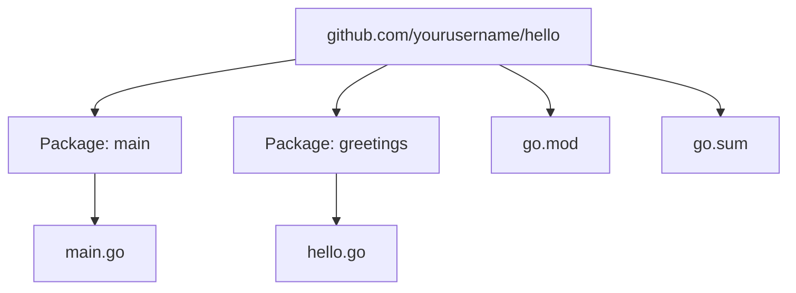

# Setup

---

# Operating System

Most Go developers use Linux or macOS for development, but Windows and others work well too.


https://go.dev/blog/survey2024-h2-results#devenv

<Tip>
I recommend developing in WSL if you're using Windows, but do remember to install Go in the WSL environment, not in Windows, and tell VS Code to run in WSL too.
</Tip>

---

# Installing Go

- https://go.dev/dl/

- Windows / Mac - download and run the installer
- Linux - download and extract the tarball, and add the Go binary directory to your PATH, see https://go.dev/doc/install

---
layout: section
---

# Starting a new project

---
layout: two-cols-header
---

# Code organisation

::left::

- Go projects are organised into "modules"
- A module is a collection of related Go "packages"
- A package is a directory containing Go source files - each file can use functions, types, and variables defined in other files in the same package
- Each package has a unique import path (e.g. `github.com/yourusername/hello/greetings`)
- The `go.mod` file at the root of a module defines the module's path and its dependencies
 - The `go.sum` file contains checksums for module dependencies to ensure integrity

::right::



---

# Create a new module

- Run `go mod init <module-path>` to create a new module

```bash
go mod init github.com/yourusername/hello
```

- This creates a `go.mod` file in the current directory

---

# Add your code

- The `main` package is the entry point for a Go program.

```
go.mod
main.go
```

```go
package main

import "fmt"

func main() {
    fmt.Println("Hello, World!")
}
```

---

# Build

- Run `go build` to compile the program

```bash
go build
```

- Because the package is `main`, this creates an executable file named `hello` (or `hello.exe` on Windows)

---

# Run

```bash
./hello
```

<!--

Automatically compiled for your OS/architecture, so on Windows it would be `hello.exe`

-->

---

# Build it for another OS/architecture

```bash
GOOS=linux GOARCH=amd64 go build -o hello-linux
```

- This creates a Linux executable named `hello-linux` even if you're on macOS or Windows

---

# Create a library package

```{3}
go.mod
main.go
greetings/hello.go
```

```go
package greetings

import "fmt"

func Hello(name string) string {
  return fmt.Sprintf("Hello, %s!", name)
}
```

---

# Use the library package

```{2}
go.mod
main.go
greetings/hello.go
```

```go
package main

import (
  "fmt"
  "github.com/yourusername/hello/greetings"
)

func main() {
  fmt.Println(greetings.Hello("World"))
}
```

---

# Hello, HTTP...

```go
package main

import (
    "fmt"
    "net/http"
)

func handler(w http.ResponseWriter, r *http.Request) {
    w.Write([]byte("Hello, via HTTP!"))
}

func main() {
    http.HandleFunc("/", handler)
    http.ListenAndServe(":8080", nil)
}
```

<!--

A HTTP server can be a few lines of code, but this isn't a realistic application.

In the workshop, we'll cover setting up a realistic web server with routing, middleware, logging, configuration, and testing.

-->

---

# About Go code

- Compact vertically
- Uses empty lines to separate concepts
- Often uses short variable names
- Clever code is discouraged
- Capitalised names are exported (public)
- Uncapitalised names are unexported (private)
- `userID` not `userId`
- `HTTPServer` not `HttpServer`
